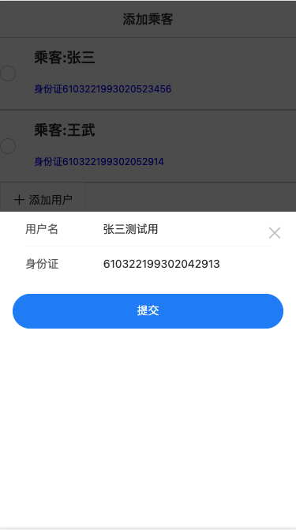
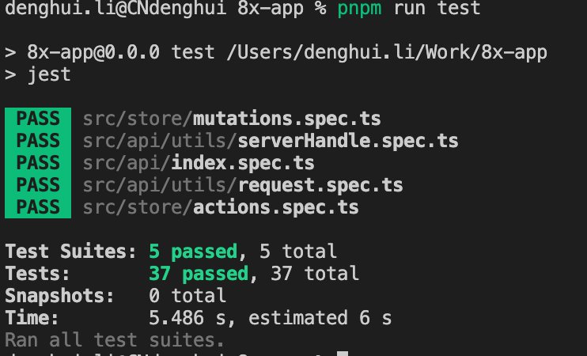

# "飞得高"航空系统

# 安装

1. 安装nodejs
2. cd 到项目根目录执行脚本
> npm install pnpm -g

> pnpm install 
3. 跑测试代码
> pnpm run test
4. 启动后端服务
> pnpm run mock
5. 启动项目服务
> pnpm run dev

# 项目成功展示

## 选择出发地、目的地、日期


## 展示符合要求的航班列表


## 选择航班，跳转到乘客添加页面，添加乘客或选择已有乘客




## 选择乘客后，点击提交按钮，确认购票，跳转到支付页面


# 文件目录介绍

```
./
├── README // README.md 文件使用图片
├── README.md
├── fake // 模拟fake后端请求
├── index.html // 项目起始模板
├── jest.config.js //测试配置
├── node_modules // 依赖库文件夹
├── package.json // 依赖配置项
├── pnpm-lock.yaml // 依赖版本锁定
├── public // 公共文件
├── src // 开发文件
│   ├── App.vue // 文件视图入口
│   ├── api // 接口API文件夹
│   │   └── utils // API工具
│   │       ├── request.ts // request 通用请求函数
│   ├── components // 通用公共组件
│   ├── constant // 常量
│   ├── env.d.ts // ts类型配置文件
│   ├── fake // 测试数据相关方法
│   ├── main.ts // 主文件入口
│   ├── model // 前后端协议接口类型
│   ├── pages // 页面目录
│   ├── routes // 路由映射文件夹
│   └── store // 业务数据文件夹
│       ├── actions.ts // 业务操作请求方法
│       ├── getters.ts // 数据加工getters
│       ├── index.ts // store出口文件
│       ├── mutations.ts // mutations方法
│       ├── state.ts // 业务数据栈
│       └── utils.ts // 辅助工具库
├── tsconfig.json // ts类型配置
└── vite.config.ts //vue开发配置
```

# 测试截图

